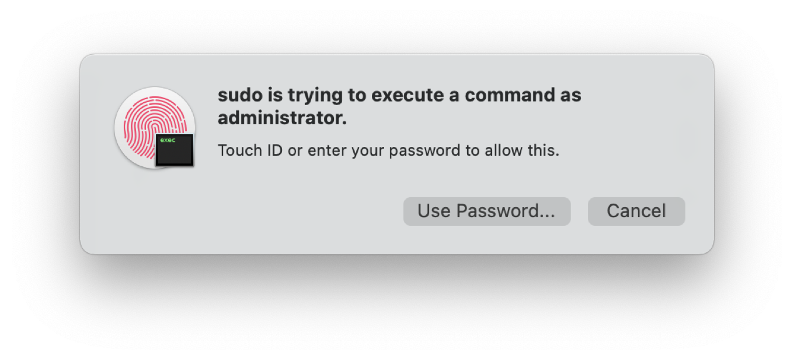

Hate typing and want to use touch ID when using sudo? The good news is that Apple has done most of the heavy lifting here by having built a pluggable authentication module (PAM) for Touch ID; all you need to do is essentially turn it on, which takes just a few simple steps.

First, open up Terminal. Navigate to the directory where the system stores the list of PAMs by typing `cd /etc/pam.d/` and open the sudo file there in your favorite text editor. Note that if you open it via the command-line, you’ll need to use sudo itself to do so, since the file is (understandably) protected.

Once you’ve opened it, add the following below the first line:

`auth sufficient pam_tid.so`

That line basically tells the sudo command that the Touch ID authentication module is sufficient to authorize the user, which is all you need to do.

Save the file and you’re done! Now, the next time you use the sudo command, instead of being prompted for your password, you’ll get a dialog box asking you to authenticate with Touch ID, just as you would any other time you needed to authenticate. (And, as an extra bonus, if you choose to click the Enter Password, you’ll get prompted to use either the password or your Apple Watch, if you have one.)

